# Assignment 1: Automated Instance Management Using AWS Lambda and Boto3

## 📌 Project Objective
This project demonstrates the automation of AWS EC2 instance lifecycle management using a serverless **AWS Lambda** function and the **Boto3 SDK** (Python). The system automatically stops or starts instances based on specific metadata tags to optimize operational efficiency and cloud costs.

---

## 🛠️ Infrastructure Setup

### 1. EC2 Configuration
Two instances were launched and tagged to define their automated behavior:
- **Auto-Stop Instance**: Tagged with `Action: Auto-Stop`.
- **Auto-Start Instance**: Tagged with `Action: Auto-Start`.

### 2. IAM Role & Permissions
A dedicated IAM execution role was created to grant the Lambda function the necessary permissions:
- **AmazonEC2FullAccess**: For describing and changing instance states.
- **AWSLambdaBasicExecutionRole**: For CloudWatch logging.

---

## 💻 Code Implementation
The following Boto3 script was deployed to the Lambda function:

```python
import boto3

def lambda_handler(event, context):
    ec2 = boto3.client('ec2')
    
    # 1. Process Auto-Stop Instances
    stop_filter = [{'Name': 'tag:Action', 'Values': ['Auto-Stop']}]
    stop_response = ec2.describe_instances(Filters=stop_filter)
    stop_ids = [i['InstanceId'] for r in stop_response['Reservations'] for i in r['Instances']]
    
    if stop_ids:
        ec2.stop_instances(InstanceIds=stop_ids)
        print(f"Stopping instances: {', '.join(stop_ids)}")

    # 2. Process Auto-Start Instances
    start_filter = [{'Name': 'tag:Action', 'Values': ['Auto-Start']}]
    start_response = ec2.describe_instances(Filters=start_filter)
    start_ids = [i['InstanceId'] for r in start_response['Reservations'] for i in r['Instances']]
    
    if start_ids:
        ec2.start_instances(InstanceIds=start_ids)
        print(f"Starting instances: {', '.join(start_ids)}")

    return {'statusCode': 200, 'body': 'Process Complete'}
```

---

## 📸 Project Evidence (Screenshots)

### 1. IAM Role Creation & Permissions
- **Role Creation:** 
- **Role Selection:** 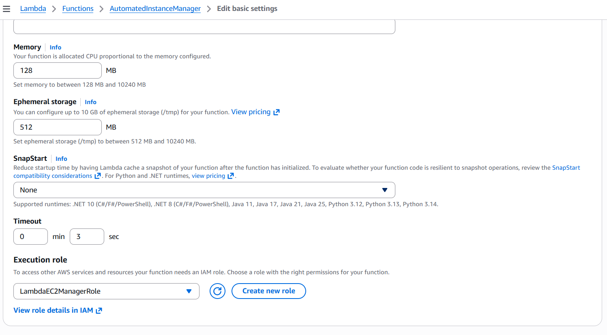
- **Permissions Pg 1:** 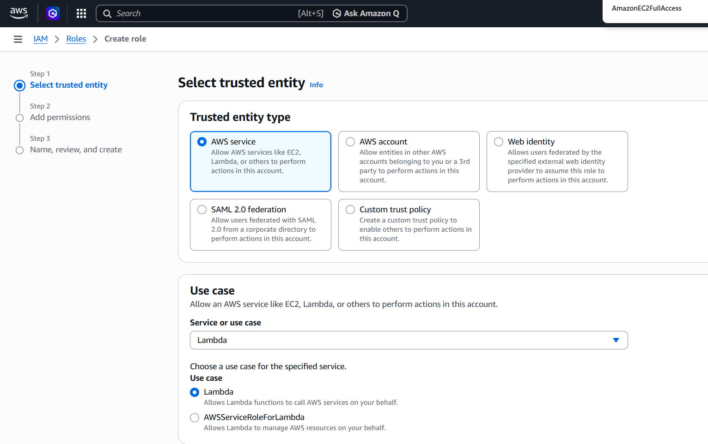
- **Permissions Pg 2:** 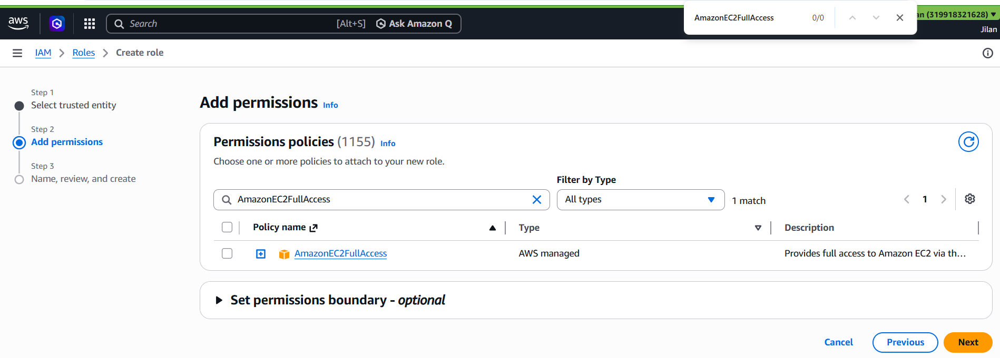
- **Permissions Pg 3:** 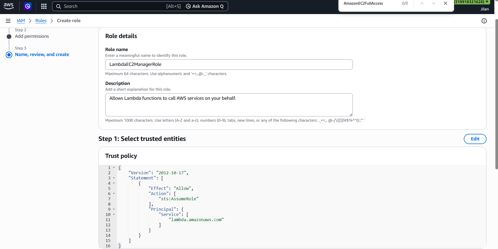

### 2. Lambda Configuration & Execution
- **Source Code:** 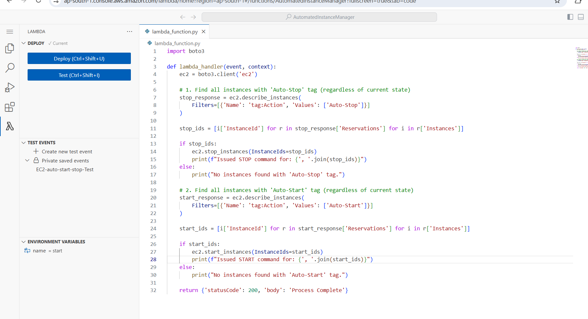
- **Execution Success:** 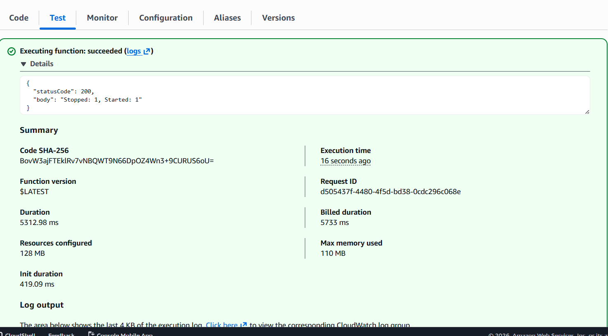
- **Instance State Log:** 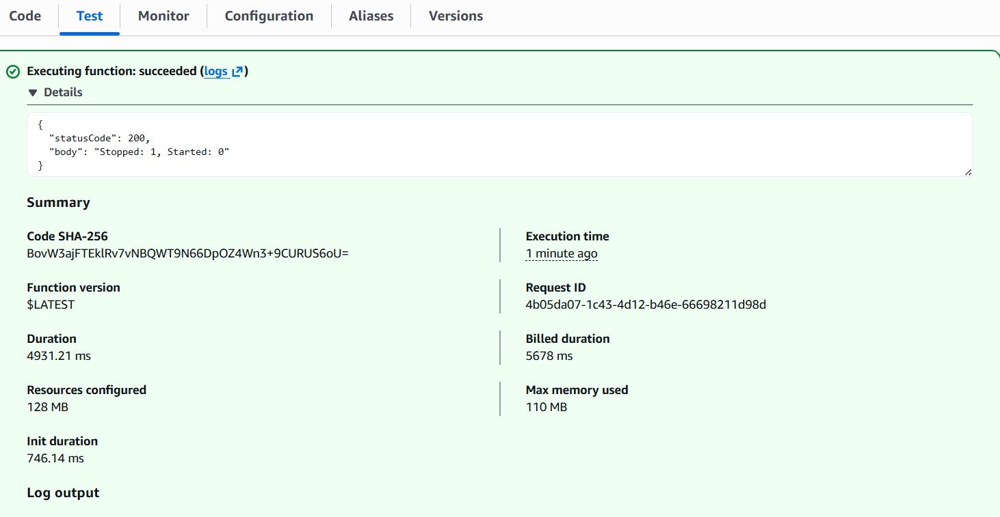

### 3. EC2 State Transitions
- **Before Execution:** 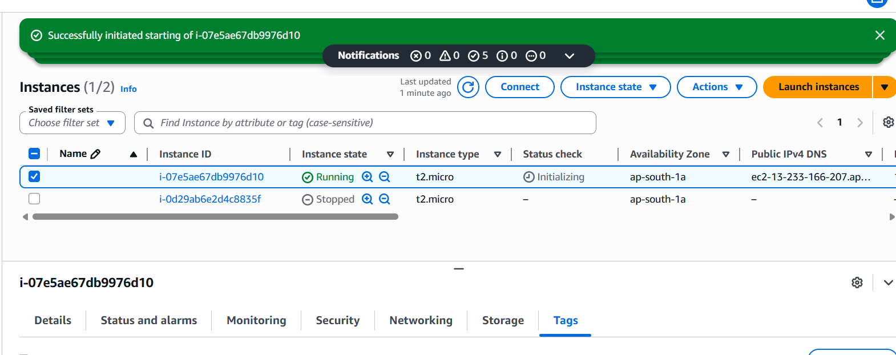
- **After Execution:** 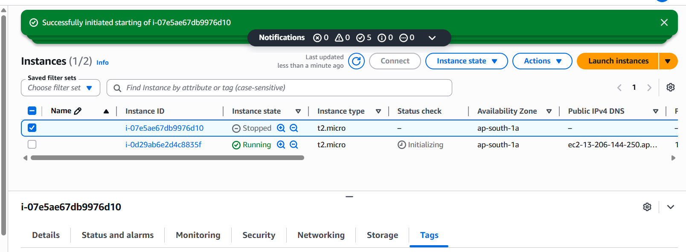
- **Stopped State Detail:** 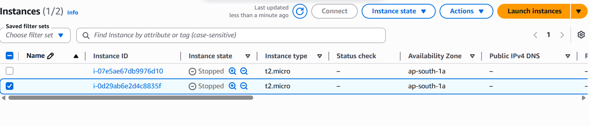

### 4. Monitoring & Metrics
- **CloudWatch Live Tail:** 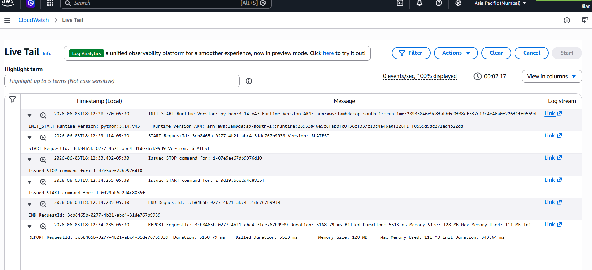
- **CloudWatch Metrics:** 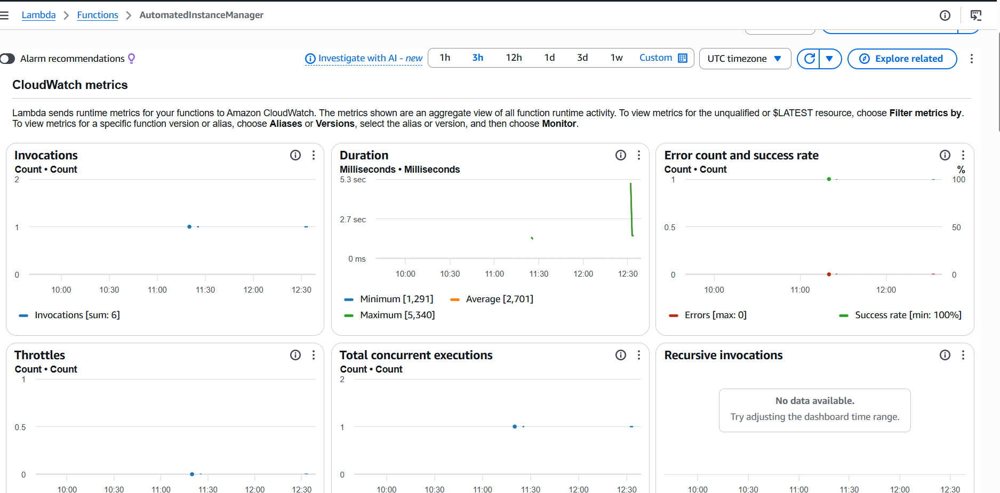

---

## 🚀 How to Run
1. **Clone the repo**: `git clone <your-repo-url>`
2. **Setup Tags**: Tag your EC2 instances with `Action: Auto-Stop` or `Auto-Start`.
3. **Deploy**: Paste `lambda_function.py` into an AWS Lambda function.
4. **Invoke**: Run a manual test in the Lambda console to trigger the automation.

## 🎓 Evaluation Criteria
- **Correctness**: Code correctly identifies and manages tagged instances via Boto3.
- **Task Completion**: Successfully demonstrated instance state changes.
- **Organization**: Project documentation follows a structured, professional format.
