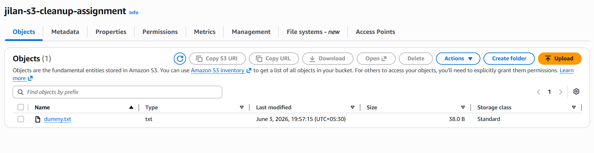
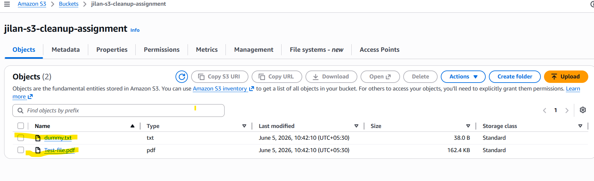
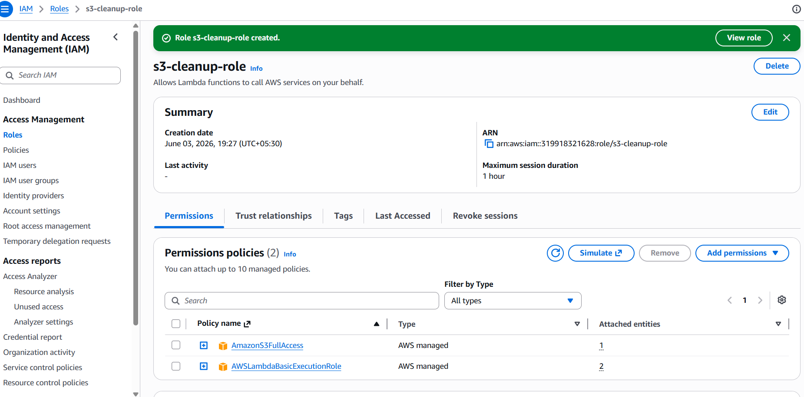
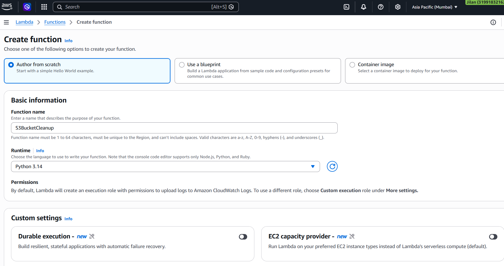
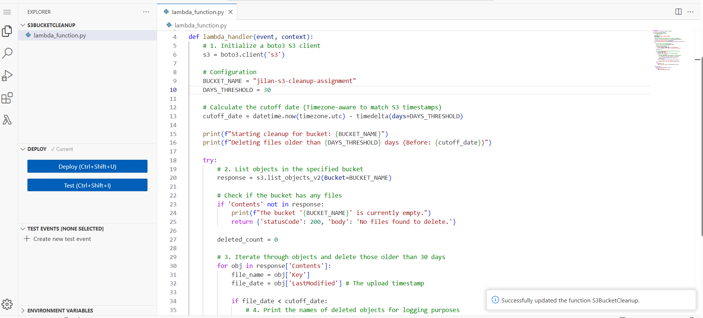
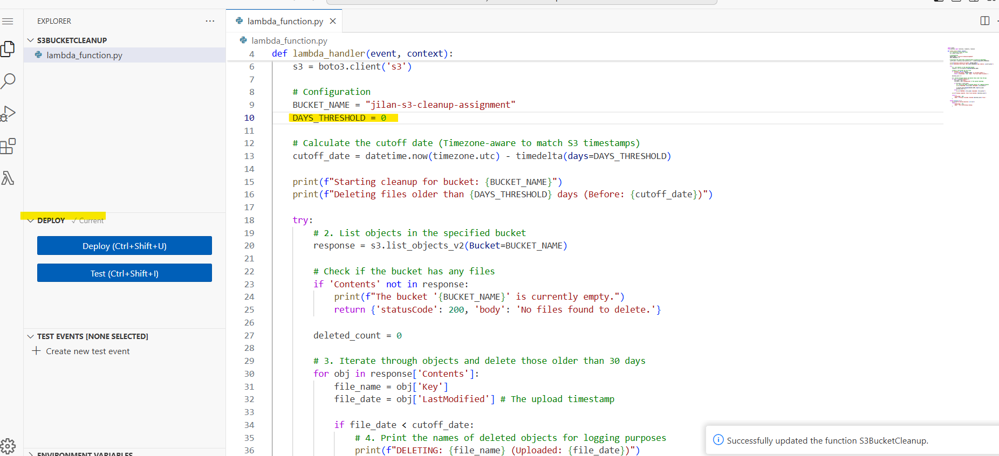
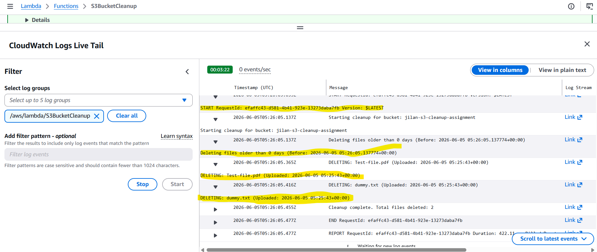
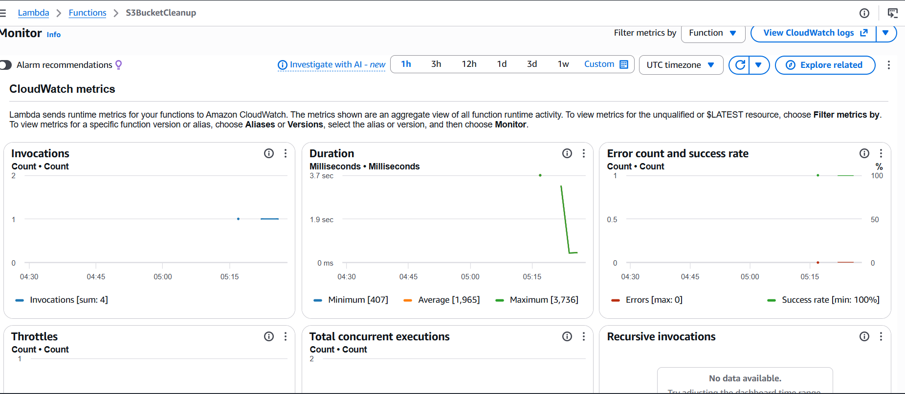
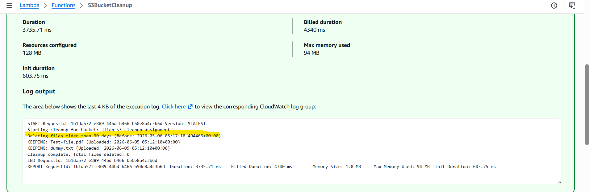
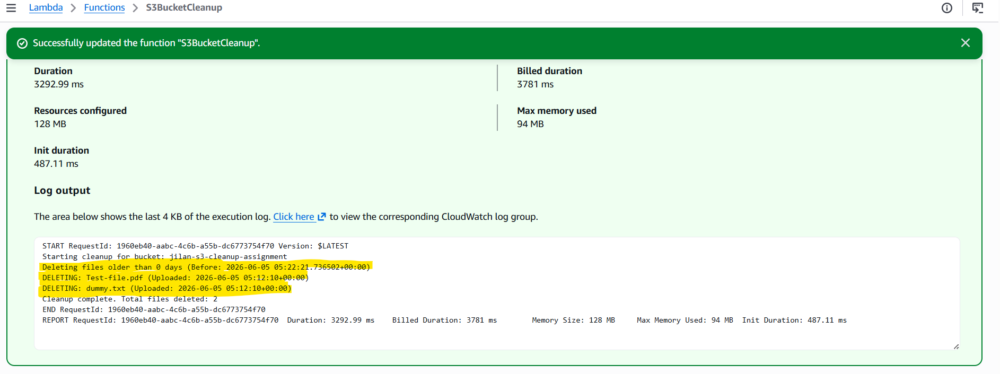

# AWS S3 Automated Cost Optimization and Lifecycle Cleanup

This repository contains an automated storage management solution using AWS Lambda and Python Boto3. It dynamically audits targeted Amazon S3 buckets to identify individual objects that have remained un-utilized beyond your corporate retention thresholds, systematically clearing old files to reduce storage costs.

---

## 🏗️ Architecture Component Overview

* **Amazon S3**: Object storage tier holding active data buckets evaluated by the cleanup automation routine.
* **AWS IAM**: Security framework defining granular access permissions for bucket object inspection and removal.
* **AWS Lambda**: Serverless computational handler managing object metadata filters and deletion actions.
* **Amazon CloudWatch**: Telemetry logging interface recording active target analysis paths and metrics.

---

## 🔧 Setup & Configuration Steps

### 1. IAM Role Configuration & Policies Assignment
To allow your Lambda function to safely evaluate and delete stale storage blocks, you must configure a runtime execution role.

1. Navigate to the **IAM Console** > **Roles** and locate your explicit S3 lifecycle role.
2. Under the **Permissions** tab, attach standard least-privilege configurations to allow object parsing:
   * **`s3:ListBucket`**: Enumerates existing object trees inside the bucket namespace.
   * **`s3:DeleteObject`**: Permanently drops expired storage items.
   * **`logs:CreateLogGroup`**, **`logs:CreateLogStream`**, & **`logs:PutLogEvents`**: Records execution print loops.

---

### 2. Lambda Code Deployment
1. Open your Lambda function editor container panel.
2. Inject the specific Boto3 execution script (`lambda_function.py`) into your workspace:

```python
import boto3
from datetime import datetime, timedelta, timezone

def lambda_handler(event, context):
    # 1. Initialize a boto3 S3 client
    s3 = boto3.client('s3')
    
    # Configuration
    BUCKET_NAME = "jilan-s3-cleanup-assignment"
    DAYS_THRESHOLD = 30
    
    # Calculate the cutoff date (Timezone-aware to match S3 timestamps)
    cutoff_date = datetime.now(timezone.utc) - timedelta(days=DAYS_THRESHOLD)
    
    print(f"Starting cleanup for bucket: {BUCKET_NAME}")
    print(f"Deleting files older than {DAYS_THRESHOLD} days (Before: {cutoff_date})")
    
    try:
        # 2. List objects in the specified bucket
        response = s3.list_objects_v2(Bucket=BUCKET_NAME)
        
        # Check if the bucket has any files
        if 'Contents' not in response:
            print(f"The bucket '{BUCKET_NAME}' is currently empty.")
            return {'statusCode': 200, 'body': 'No files found to delete.'}

        deleted_count = 0
        
        # 3. Iterate through objects and delete those older than 30 days
        for obj in response['Contents']:
            file_name = obj['Key']
            file_date = obj['LastModified'] # The upload timestamp
            
            if file_date < cutoff_date:
                # 4. Print the names of deleted objects for logging purposes
                print(f"DELETING: {file_name} (Uploaded: {file_date})")
                
                s3.delete_object(Bucket=BUCKET_NAME, Key=file_name)
                deleted_count += 1
            else:
                print(f"KEEPING: {file_name} (Uploaded: {file_date})")
        
        print(f"Cleanup complete. Total files deleted: {deleted_count}")
        
        return {
            'statusCode': 200,
            'body': f"Process finished. Deleted {deleted_count} files."
        }

    except Exception as e:
        print(f"Error during execution: {str(e)}")
        return {
            'statusCode': 500,
            'body': 'Error performing cleanup.'
        }
```

---

## 📊 Infrastructure Verification & Outputs

The following visual artifacts document the baseline bucket structures, policy initializations, execution runtime states, and performance monitoring dashboards.

### S3 Baseline Infrastructure
The storage profile, bucket directory indexes, and resource parameters tracked inside the cloud console before running cleanup scripts.



### Lambda Configuration & Identity Management
The deployed source codes and the access security policy structures configured to control bucket inspection boundaries.





### CloudWatch Telemetry & Execution Prints
The system diagnostic outputs, text trace logs, and system metrics verifying object removal operations.




