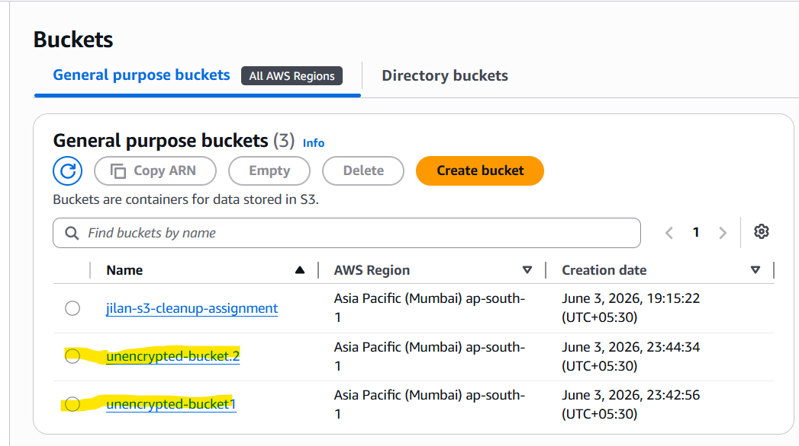
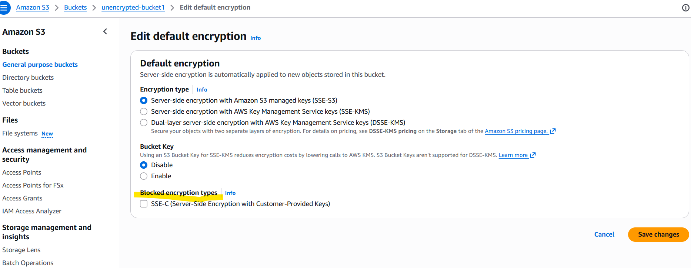
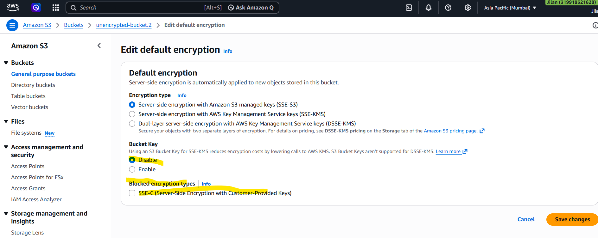
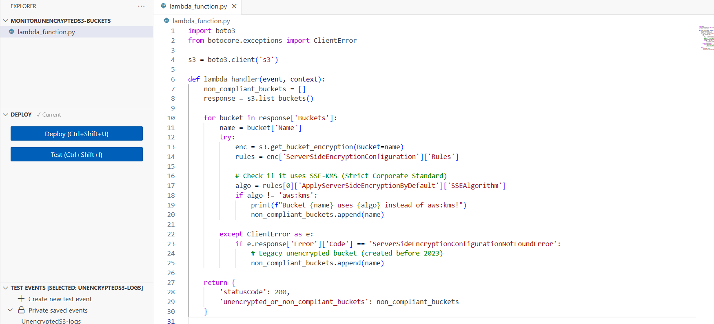
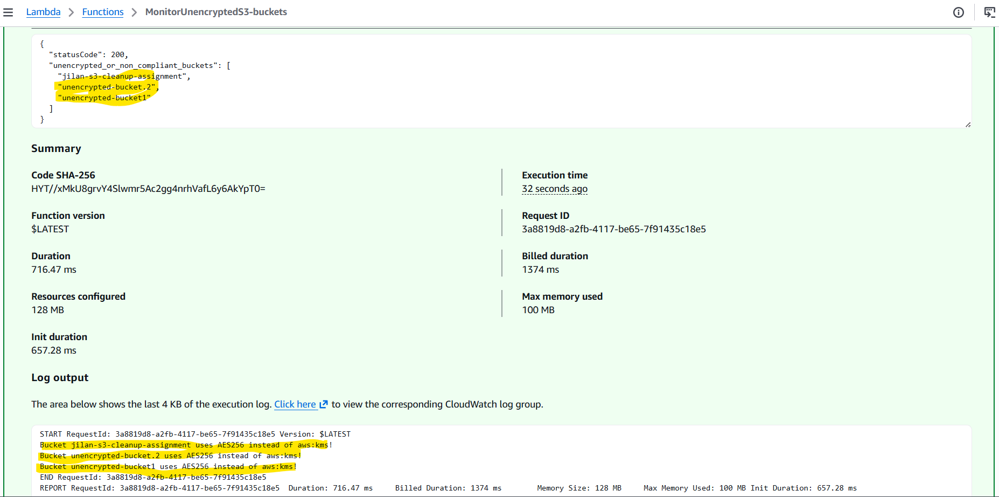
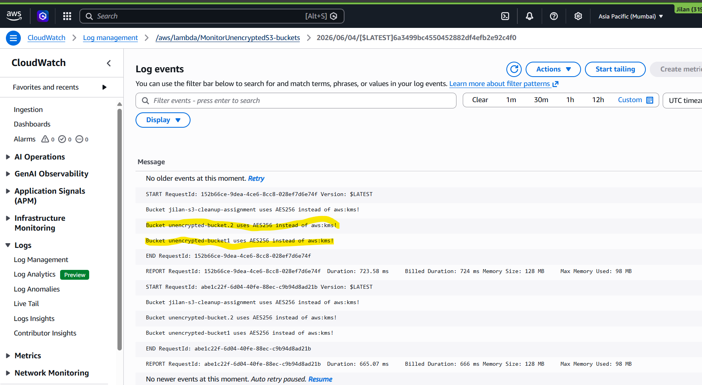
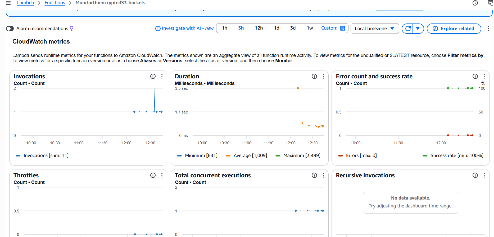

# AWS S3 Security Auditing with Lambda

This repository contains an automated solution using AWS Lambda to audit Amazon S3 buckets. It identifies buckets that fail to meet compliance standards by missing strict **SSE-KMS** corporate encryption configurations.

---

## 🏗️ Architecture Component Overview

* **Amazon S3**: Object storage resource evaluated by the auditing script.
* **AWS IAM**: Execution identity managing component permissions boundaries.
* **AWS Lambda**: Serverless computing environment hosting the auditing logic.
* **Amazon CloudWatch**: Diagnostic framework storing structural execution prints.

---

## 🔧 Setup & Configuration Steps

### 1. IAM Role Configuration & Policies Assignment
To allow your Lambda function to securely inspect buckets and write execution traces, you must configure a runtime execution role.

1. Navigate to the **IAM Console** > **Roles** and select your execution role.
2. Under the **Permissions** tab, attach the following two **AWS Managed Policies**:
   * **`AmazonS3ReadOnlyAccess`**: Grants full capability to enumerate assets and read internal configurations.
   * **`AWSLambdaBasicExecutionRole`**: Grants the required authority to build execution streams and record operational feedback.

---

### 2. Lambda Code Deployment
1. Open your Lambda function runtime panel.
2. Insert the specific evaluation script into the code container workspace:

```python
import boto3
from botocore.exceptions import ClientError

s3 = boto3.client('s3')

def lambda_handler(event, context):
    non_compliant_buckets = []
    response = s3.list_buckets()
    
    for bucket in response['Buckets']:
        name = bucket['Name']
        try:
            enc = s3.get_bucket_encryption(Bucket=name)
            rules = enc['ServerSideEncryptionConfiguration']['Rules']
            
            # Check if it uses SSE-KMS (Strict Corporate Standard)
            algo = rules[0]['ApplyServerSideEncryptionByDefault']['SSEAlgorithm']
            if algo != 'aws:kms':
                print(f"Bucket {name} uses {algo} instead of aws:kms!")
                non_compliant_buckets.append(name)
                
        except ClientError as e:
            if e.response['Error']['Code'] == 'ServerSideEncryptionConfigurationNotFoundError':
                # Legacy unencrypted bucket (created before 2023)
                non_compliant_buckets.append(name)
                
    return {
        'statusCode': 200,
        'unencrypted_or_non_compliant_buckets': non_compliant_buckets
    }
```

---

## 📊 Infrastructure Verification & Outputs

The following visual artifacts document the setup stages, code baseline, execution evaluations, and platform auditing outputs.

---

### S3 Baseline Infrastructure




---

### Lambda Configuration



---

### CloudWatch Telemetry


