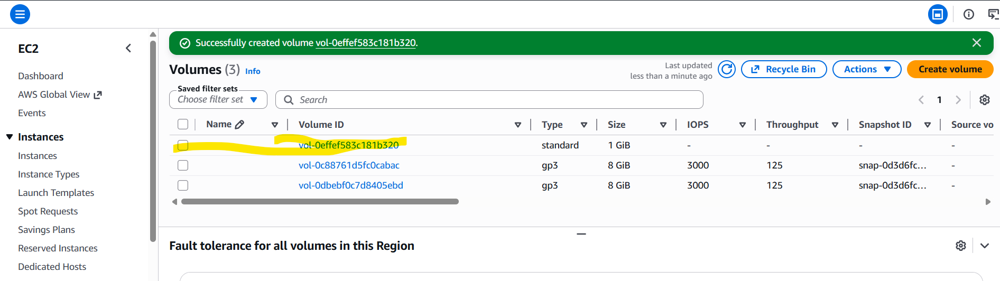
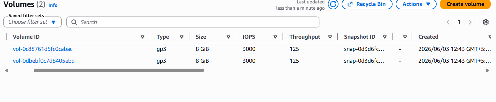
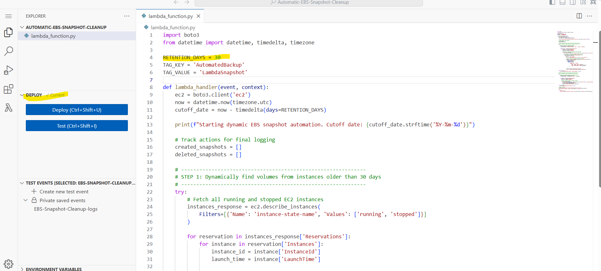
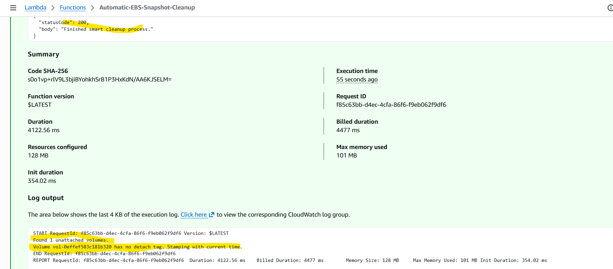
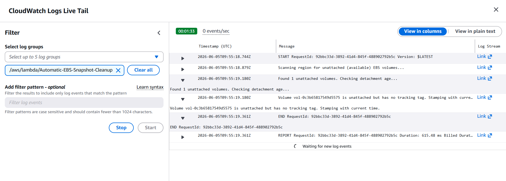
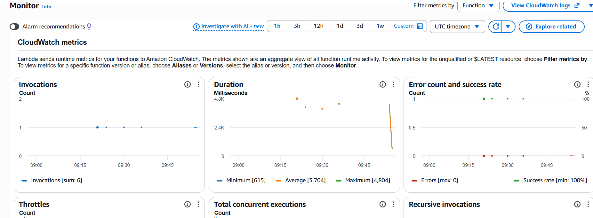
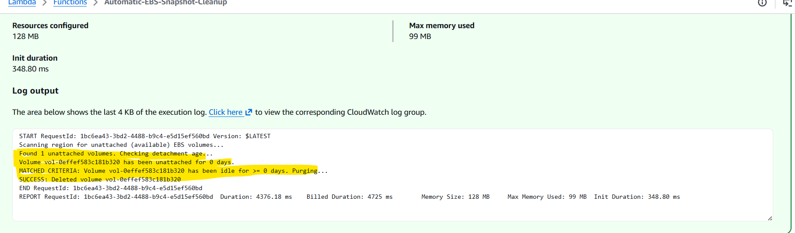

# AWS EBS Volume and Snapshot Lifecycle Management with Lambda

This repository contains an automated cost-optimization solution using AWS Lambda and Python Boto3. It dynamically scans your AWS region to identify unattached (idle) Elastic Block Store (EBS) volumes, tracks their idle duration using tag timestamps, and automatically purges both the volumes and their associated snapshot backups once they exceed your corporate retention thresholds.

---

## 🏗️ Architecture Component Overview

* **Amazon EC2 / EBS**: Persistent storage block resources and backup snapshots evaluated by the lifecycle script.
* **AWS IAM**: Execution identity managing granular security permissions and resource boundaries.
* **AWS Lambda**: Serverless computing environment hosting the Boto3 resource automation logic.
* **Amazon CloudWatch**: Diagnostic logging framework tracking runtime evaluations and deletion streams.

---

## 🔧 Setup & Configuration Steps

### 1. IAM Role Configuration & Policies Assignment
To allow your Lambda function to securely inspect storage drives, apply metadata tracking tags, and delete legacy backups, you must configure a runtime execution role.

1. Navigate to the **IAM Console** > **Roles** and select your Lambda execution role.
2. Under the **Permissions** tab, attach a customized inline policy containing these mandatory actions:
   * **`ec2:DescribeVolumes`** & **`ec2:DescribeSnapshots`**: Enumerate available assets across the active AWS region.
   * **`ec2:CreateTags`**: Write discovery timestamps onto idle resources.
   * **`ec2:DeleteVolume`** & **`ec2:DeleteSnapshot`**: Safely remove expired infrastructure items.
   * **`logs:CreateLogGroup`**, **`logs:CreateLogStream`**, & **`logs:PutLogEvents`**: Record real-time operational feedback.

---

### 2. Lambda Code Deployment
1. Open your Lambda function runtime panel and adjust the **Timeout** configuration under *General Configuration* to **1 minute** to handle iterative snapshot evaluations safely.
2. Insert the specific lifecycle evaluation script (`lambda_function.py`) into the code container workspace:

```python
import boto3
from datetime import datetime, timezone

# Global Configuration
RETENTION_DAYS = 30

def lambda_handler(event, context):
    ec2 = boto3.client('ec2')
    now = datetime.now(timezone.utc)
    now_str = now.isoformat()
    
    # 1. Dynamically discover all currently unattached volumes
    print("Scanning region for unattached (available) EBS volumes...")
    try:
        vol_response = ec2.describe_volumes(
            Filters=[{'Name': 'status', 'Values': ['available']}]
        )
        volumes = vol_response.get('Volumes', [])
    except Exception as e:
        print(f"ERROR fetching volumes from EC2: {str(e)}")
        return {'statusCode': 500, 'body': 'Failed to scan volumes.'}

    if not volumes:
        print("No unattached volumes found in this region.")
        return {'statusCode': 200, 'body': 'No unattached volumes found.'}
        
    print(f"Found {len(volumes)} unattached volumes. Checking detachment age...")
    
    for vol in volumes:
        vol_id = vol['VolumeId']
        detach_time_str = None
        
        # Parse tags to look for custom tracking timestamp
        for tag in vol.get('Tags', []):
            if tag['Key'] == 'DetachedAt':
                detach_time_str = tag['Value']
                break
                
        # CASE A: Volume newly unattached -> Apply tracking tag and evaluate next cycle
        if not detach_time_str:
            print(f"Volume {vol_id} is unattached but lacks tracking metadata. Stamping timestamp.")
            try:
                ec2.create_tags(
                    Resources=[vol_id],
                    Tags=[{'Key': 'DetachedAt', 'Value': now_str}]
                )
            except Exception as e:
                print(f"Failed to apply tracking tag to {vol_id}: {str(e)}")
            continue
            
        # CASE B: Tag exists -> Calculate strict idle time duration
        detach_time = datetime.fromisoformat(detach_time_str)
        idle_time = now - detach_time
        
        print(f"Volume {vol_id} has been unattached for {idle_time.days} days.")
        
        # Validate asset against retention policy threshold
        if idle_time.days >= RETENTION_DAYS:
            print(f"MATCHED CRITERIA: Volume {vol_id} has been idle for >= {RETENTION_DAYS} days. Purging...")
            
            # Step A: Clear dependencies (Snapshot backup loop)
            try:
                snap_response = ec2.describe_snapshots(
                    Filters=[{'Name': 'volume-id', 'Values': [vol_id]}]
                )
                for snap in snap_response.get('Snapshots', []):
                    snap_id = snap['SnapshotId']
                    print(f"-> Deleting snapshot backup dependency: {snap_id}")
                    ec2.delete_snapshot(SnapshotId=snap_id)
            except Exception as e:
                print(f"Warning: Dependent snapshot cleanup failed for {vol_id}: {str(e)}")
                
            # Step B: Securely delete the underlying volume asset
            try:
                ec2.delete_volume(VolumeId=vol_id)
                print(f"SUCCESS: Wiped out idle volume {vol_id}")
            except Exception as e:
                print(f"ERROR deleting volume {vol_id}: {str(e)}")
        else:
            days_left = RETENTION_DAYS - idle_time.days
            print(f"KEEPING ASSET: Volume {vol_id} is within safe parameters. Deletion target in {days_left} days.")
            
    return {'statusCode': 200, 'body': 'Unattached volume cleanup check complete.'}
```

---

## 📊 Infrastructure Verification & Outputs

The following visual artifacts document the setup stages, code deployment paths, and environment state results during the testing procedures.

### EBS Baseline Infrastructure
The initial state of the block storage infrastructure before executing runtime automations.



### Lambda Configuration
The setup parameters and testing conditions configured within the AWS Lambda console environment.



### CloudWatch Telemetry
System diagnostic outputs and confirmation traces confirming successful evaluation paths.




